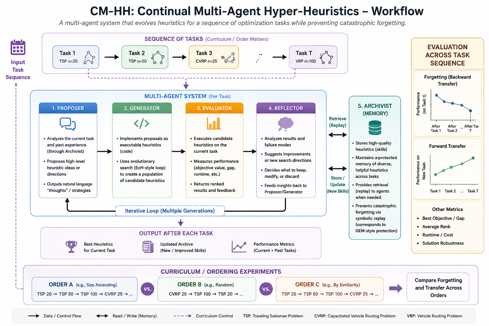

# CM-HH: Continual Multi-Agent Hyper-Heuristics

- Built upon the code base of
    
    [https://github.com/microsoft/HeurAgenix](https://github.com/microsoft/HeurAgenix)
    

This document is meant to take you from zero to running your first experiment. Read it in order — each section assumes you've absorbed the one before it. Don't skip the background reading; the whole project only makes sense once you've seen what EoH, HMACE, and classical continual learning look like separately.



## 1. The One-Paragraph Version

We're building a team of LLM agents that discovers heuristics for combinatorial optimization (CO) problems — things like the Traveling Salesman Problem (TSP) or Vehicle Routing (CVRP) — the way recent papers like EoH and HMACE do. But instead of solving one fixed problem in one session (what every existing paper does), our team faces a **sequence** of different problems or problem sizes over time, the way a real deployed system would. The question we're asking, that nobody has asked yet: **does the agent team forget how to solve earlier problems as it learns new ones, and can we stop it from forgetting using ideas borrowed from continual learning (memory replay) and curriculum learning (task ordering)?**

If that sentence doesn't fully make sense yet, that's fine — Section 2 unpacks every piece of it.

---

## 2. Required Background Reading (do this before writing any code)

Read these in this order. For each, you need to understand *what problem it solves* and *what its architecture looks like* — you don't need to reproduce their results.

1. **FunSearch** (Romera-Paredes et al.) — the original idea of pairing an LLM with an evaluator in an evolutionary loop to discover code/heuristics. This is the ancestor of everything below.
2. **EoH (Evolution of Heuristics)** — represents heuristics as natural-language "thoughts" that get translated into code, evolved via an LLM-driven evolutionary loop. This is the algorithm your Generator agent will essentially run. Get EoH's public code running on a toy TSP instance before you touch our system — if you can't get EoH working standalone, you can't debug our system either.
3. **HMACE** — splits the evolutionary loop into four specialized LLM agents (Proposer, Generator, Evaluator, Reflector) instead of one monolithic loop. This is the closest architectural relative to what we're building — study its agent-role split carefully.
4. **HeurAgenix** — a different four-agent split (generation, evolution, evaluation, selection), useful as a second reference point so you don't over-anchor on HMACE's specific choices.
5. **CORAL** — agents share a persistent memory ("skills") across a long search session. This is the closest thing to our Archivist, but CORAL never tests across a *sequence of different tasks* — that's exactly our gap.
6. **Classical continual learning — read at least the concepts, not full papers:**
    - *Catastrophic forgetting* (McCloskey & Cohen, 1989) — the original observation that neural nets overwrite old knowledge when learning new tasks.
    - *GEM / episodic memory replay* (Lopez-Paz & Ranzato, 2017) — the idea of keeping a protected memory of old-task examples so the model can't fully overwrite them. Our Archivist's "protection" mechanism is a symbolic (non-gradient) version of this idea.
    - *Backward transfer / forward transfer metrics* — the standard way continual learning papers measure forgetting. We're borrowing these metrics directly; Section 7 gives you the exact formulas.

**Checkpoint before moving on**: you should be able to explain, in your own words, why CORAL's shared memory *doesn't* automatically solve our problem, even though it sounds similar. (Hint: CORAL never re-tests old tasks after new ones are introduced — it has no forgetting metric at all.)

---

## 3. The Research Question and Hypotheses

**Research question**: When a multi-agent LLM hyper-heuristic system is exposed to a sequence of CO tasks (either increasing problem sizes, or different problem types), does it forget how to solve earlier tasks — and can a memory-protection mechanism plus a deliberate task ordering (curriculum) reduce that forgetting without sacrificing performance on new tasks?

**Hypotheses to test** (these become your paper's claims if confirmed):

- **H1**: A naive system with no memory protection (just overwriting old heuristics as new ones are found) will show measurable negative backward transfer — i.e., it gets worse at old tasks after learning new ones.
- **H2**: A protected-memory (replay-style) Archivist reduces this forgetting relative to naive overwrite, without meaningfully hurting new-task performance.
- **H3**: Task order matters — introducing structurally similar tasks adjacent to each other (or a size-ascending order) produces less forgetting and/or faster acquisition than a random order, holding the memory mechanism fixed.

You are not trying to prove all three are true. If H1 doesn't hold (no forgetting happens at all), that's still a publishable, honest negative result — it would mean LLM-based symbolic memory is naturally more forgetting-resistant than gradient-based memory, which is itself interesting and worth reporting. Don't p-hack toward confirming H2/H3 if the data doesn't support them.

---

## 4. System Architecture

Four agents. Each one is a *role*, not necessarily a separate LLM — in practice they can all be the same underlying model (e.g., one API-based LLM) called with different system prompts/instructions per role. Keep them logically separate in code even if they share a backend.

```
┌─────────────────┐     seeds task k        ┌──────────────┐
│ Curriculum       │──────────────────────▶ │  Archivist   │
│ Scheduler         │                       │ (memory)     │
│ (fixes task order │◀──────────────────────│              │
│  before run start)│   stores results       └──────┬───────┘
└─────────────────┘                                 │ retrieves
                                                       │ seed heuristics
                                                       ▼
                                              ┌──────────────┐
                                              │  Generator   │◀────┐
                                              │ (EoH-style   │     │ mutate/
                                              │  evolution)  │     │ select
                                              └──────┬───────┘     │
                                                       │ candidates │
                                                       ▼            │
                                              ┌──────────────┐      │
                                              │  Evaluator   │──────┘
                                              │ (runs heuristic on
                                              │  task instances,
                                              │  CPU only)   │
                                              └──────────────┘
```

### 4.1 Generator

Runs a standard EoH-style evolutionary loop for the *current* task only: maintain a population of heuristics (as code + natural-language "thought" describing the idea), each generation ask the LLM to mutate/combine the best performers into new candidates, hand them to the Evaluator, keep the best. Nothing here is new — implement this by adapting EoH's public code, don't write it from scratch.

### 4.2 Evaluator

Pure execution: runs a candidate heuristic (Python function) against a batch of problem instances, returns a fitness score (e.g., average optimality gap vs. a reference solver, or vs. best-known solution). No LLM call. This must run in a sandbox (see Section 6.3) since you're executing LLM-generated code.

### 4.3 Archivist — the core contribution, build this carefully

Maintains a persistent store: a list of records `{task_id, heuristic_code, fitness, instance_features, times_retrieved}`.

Three jobs:

- **Retrieval**: at the start of task k, compute simple instance-feature similarity (e.g., cosine similarity over a vector of [avg instance size, density, constraint type]) between k and all prior tasks, pull the top-m heuristics from the most similar prior tasks, and seed the Generator's initial population with them.
    
    kk
    
    kk
    
    mm
    
- **Protection**: reserve a fixed number of "exemplar" heuristics per completed task that are *never evicted or overwritten*, regardless of storage pressure. These are what you re-evaluate later to measure forgetting.
- **Consolidation policy** (this is your main independent variable — implement all three, you'll compare them):
    1. `naive_overwrite`: no protection at all, oldest/lowest-fitness entries get evicted when storage is full — this is your expected-to-fail baseline.
    2. `fixed_quota_replay`: each task gets a fixed slot budget (e.g., top-5 heuristics protected); once a task's quota is full, only within-task eviction happens, cross-task entries are never touched.
    3. `utility_weighted_retention`: track `times_retrieved` for every heuristic; when eviction is needed, evict the lowest-retrieval-count entries first, regardless of which task they came from.

### 4.4 Curriculum Scheduler

Not an active decision-maker during the run — it's a configuration choice made *before* the experiment starts. It outputs a fixed task order. You'll run the same system multiple times with different orders (see Section 5.2).

---

## 5. Baselines and Experimental Conditions

Be precise about this — muddled baselines are the single most common reason student projects get "what exactly are you comparing against?" as a review comment.

### 5.1 The three system-level conditions

| Condition | Memory | Curriculum | Purpose |
| --- | --- | --- | --- |
| **Isolated-task baseline** | None — every task solved from scratch, independently, no stream at all | N/A | Establishes the *ceiling* for per-task performance and gives you a "there was nothing to forget" reference point |
| **Naive-sequential** | `naive_overwrite`, random task order | Random | The realistic failure mode — what you'd get if you just chained HMACE/EoH across tasks without thinking about memory. This is your main point of comparison. |
| **CM-HH (full system)** | `utility_weighted_retention` | Best-performing order from your curriculum ablation | The proposed system |

### 5.2 The ablation grid

Cross consolidation policy (3 options, §4.3) with curriculum order (3 options below) = 9 conditions. Run **at least 3 random seeds per condition** — LLM-evolutionary search is noisy, and a single run per condition will not survive review.

Curriculum orders to test:

- **Size-ascending** (for the within-problem stream) or **structurally-similar-first** (for the cross-problem stream — routing problems adjacent to each other, scheduling problems separated)
- **Random order** (control)
- **Empirically-measured-similarity order**: instead of your own guess about which tasks are "similar," run a quick pilot measuring actual heuristic-transfer success rate between task pairs, and order by that. This addresses the obvious reviewer objection that "structurally similar" is just your own opinion.

---

## 6. Task Streams — What to Actually Run

### 6.1 Pilot: within-problem stream (do this first, it's cheaper and faster to debug)

TSP-20 → TSP-50 → TSP-100 → TSP-200, uniform random Euclidean instances (standard generator: sample points uniformly in a unit square). Use Concorde or LKH to generate reference optimal/near-optimal tours for computing optimality gap. This isolates scale-shift forgetting with minimal moving parts — get this fully working, debugged, and showing *some* signal before touching the cross-problem stream.

### 6.2 Main experiment: cross-problem stream

TSP → CVRP → Online BPP → PFSP (Permutation Flow Shop Scheduling). All four have standard instance generators and published EoH/HMACE baseline numbers you can sanity-check your Evaluator against. Use moderate instance sizes (matching what EoH/HMACE report) so your numbers are directly comparable to published baselines.

### 6.3 Practical note on running LLM-generated code safely

Every heuristic the Generator produces is LLM-generated Python — run it in a subprocess with a timeout and resource limits, never `exec()` in the main process. EoH's public repo already has sandboxing code; reuse it rather than writing your own from scratch.

---

## 7. Metrics — Exact Formulas

Let (a_{k,j}) be the performance on task (j)’s held-out instances, measured immediately after completing task (k) (only defined for (j le k)). Use optimality gap (lower is better), or transform your metric consistently so “higher is better”.

- **Average performance after all (K) tasks**:
    
    $$
    \bar{A}=\frac{1}{K}\sum_{j=1}^{K} a_{K,j}
    $$
    
- **Backward transfer (forgetting)**:
    
    $$
    \mathrm{BWT}=\frac{1}{K-1}\sum_{j=1}^{K-1}\left(a_{K,j}-a_{j,j}\right)
    $$
    
    Negative BWT ⇒ forgetting occurred. This is your headline number — also plot a forgetting curve over (k), not just the final value.
    
- **Forward transfer**:
    
    $$
    \mathrm{FWT}=\frac{1}{K-1}\sum_{k=2}^{K}\left(a_{k,k}-a^{\text{cold-start}}_{k}\right)
    $$
    
    where (a^{text{cold-start}}_{k}) is the isolated-task baseline performance on task (k). Positive FWT ⇒ the archive/curriculum helped acquire new tasks faster.
    

**Report all three with variance across your 3+ seeds** — a bar chart with no error bars will not survive review given how noisy LLM-evolutionary search is.

---

## 8. Suggested Repository Structure

```
cm-hh/
├── agents/
│   ├── generator.py       # EoH-style evolutionary loop, adapted from EoH public repo
│   ├── evaluator.py       # sandboxed execution + fitness scoring
│   ├── archivist.py       # the three consolidation policies live here
│   └── scheduler.py       # fixed task-order configs
├── tasks/
│   ├── tsp.py              # instance generator + reference solver hook
│   ├── cvrp.py
│   ├── bpp.py
│   └── pfsp.py
├── streams/
│   ├── within_problem.yaml   # TSP-20→50→100→200 config
│   └── cross_problem.yaml    # TSP→CVRP→BPP→PFSP config
├── experiments/
│   └── run_stream.py       # main driver: iterates tasks, calls agents, logs a_{k,j} after every task
├── metrics/
│   └── continual_metrics.py  # BWT, FWT, avg performance computation from logged a_{k,j}
└── results/
    └── (raw logs + generated figures go here)
```

### 8.1 Minimal skeleton for the main driver loop

This is pseudocode, not a working implementation — expect to spend real engineering time filling this in.

python

```python
def run_stream(task_order, consolidation_policy, seed):
    archivist = Archivist(policy=consolidation_policy)
    performance_log = {}  # performance_log[k][j] = a_{k,j}

    for k, task in enumerate(task_order):
        seeds = archivist.retrieve(task, top_m=5)
        best_heuristic = generator_evaluator_loop(
            task=task,
            seed_population=seeds,
            generations=N_GENERATIONS,
            seed=seed,
        )
        archivist.store(task_id=task.id, heuristic=best_heuristic)

        # re-evaluate on EVERY task seen so far, including this one
        performance_log[k] = {}
        for j, prior_task in enumerate(task_order[:k+1]):
            best_j = archivist.get_protected_best(prior_task.id)
            performance_log[k][j] = evaluate(best_j, prior_task.held_out_instances)

    return performance_log
```

### 8.2 Skeleton for the Archivist's consolidation policies

python

```python
class Archivist:
    def __init__(self, policy: str, capacity: int = 200):
        self.records = []  # list of dicts: task_id, code, fitness, features, retrieval_count
        self.policy = policy
        self.capacity = capacity

    def store(self, task_id, heuristic):
        self.records.append({
            "task_id": task_id, "code": heuristic.code,
            "fitness": heuristic.fitness, "features": heuristic.features,
            "retrieval_count": 0, "protected": False,
        })
        self._mark_protected_exemplars(task_id)  # freeze top-N for this task
        if len(self.records) > self.capacity:
            self._evict()

    def _evict(self):
        candidates = [r for r in self.records if not r["protected"]]
        if self.policy == "naive_overwrite":
            candidates.sort(key=lambda r: r["fitness"])  # worst fitness evicted
        elif self.policy == "fixed_quota_replay":
            candidates = self._within_task_oldest(candidates)
        elif self.policy == "utility_weighted_retention":
            candidates.sort(key=lambda r: r["retrieval_count"])
        self.records.remove(candidates[0])

    def retrieve(self, task, top_m=5):
        scored = [(self._similarity(task, r["features"]), r) for r in self.records]
        scored.sort(reverse=True, key=lambda x: x[0])
        top = [r for _, r in scored[:top_m]]
        for r in top:
            r["retrieval_count"] += 1
        return top
```

Fill in `_similarity`, `_mark_protected_exemplars`, and `_within_task_oldest` yourselves — these are small enough to design as a team exercise rather than something to hand you fully solved.

---

## 9. Weekly Milestone Plan (rough guide, adjust as needed)

| Week | Goal |
| --- | --- |
| 1–2 | Finish background reading (Section 2). Get EoH's public repo running standalone on TSP. |
| 3 | Implement Generator/Evaluator wrapper around EoH for our task interface. Confirm it reproduces EoH's published numbers on TSP as a sanity check. |
| 4 | Implement Archivist with `naive_overwrite` only. Build the within-problem pilot stream (TSP-20→200). Get one full run end-to-end, even if buggy. |
| 5 | Implement `fixed_quota_replay` and `utility_weighted_retention`. Implement metrics module (BWT/FWT). Produce your first forgetting curve — even a noisy, single-seed one. |
| 6 | Multi-seed runs on the pilot stream (3 seeds × 3 policies × naive random order). Sanity-check: does naive-overwrite show *any* forgetting? If not, debug before proceeding — this is your H1 checkpoint. |
| 7–8 | Extend to cross-problem stream (TSP→CVRP→BPP→PFSP). Implement curriculum order variants. |
| 9 | Full 9-cell ablation grid, 3 seeds each, on the cross-problem stream. |
| 10 | Generate all figures/tables (Section 10). Draft results section. |
| 11–12 | Write full paper draft, internal review pass, revise. |

---

## 10. How to Report Results

### 10.1 Required figures

1. **Forgetting curve** (main figure): x-axis = task index k, y-axis = ak,j for a fixed early task j (e.g., task 1), one line per consolidation policy. This is the single figure that makes or breaks the paper's core claim — spend the most design effort here.
    
    kk
    
    ak,ja_{k,j}
    
    jj
    
2. **Ablation grid heatmap**: 3×3 (policy × curriculum), cell value = final BWT, so a reader can see the interaction between the two variables at a glance.
    
    BWTBWT
    
3. **Forward transfer bar chart**: per task, CM-HH vs. cold-start baseline, with error bars across seeds.

### 10.2 Required tables

- Average performance, BWT, FWT for each of the three system-level conditions (§5.1), with mean ± std across seeds.
    
    BWT, FWT
    
- Per-task optimality gap table, isolated-baseline vs. naive-sequential vs. CM-HH, so a reader can see task-by-task where the gains/losses come from, not just aggregates.

### 10.3 Statistical honesty

- Report variance, not just means, everywhere.
- If a difference between conditions is within one standard deviation, say so explicitly rather than implying significance from a bar chart alone. Given the effort level in this project, a modest but honest positive result beats an overstated one that doesn't replicate.
- If H1 or H3 don't hold, report that plainly (see Section 3) — a clean negative result with solid metrics is a legitimate AAMAS contribution.

### 10.4 Related work / positioning section (for the paper itself)

Structure this as: (1) LLM-based hyper-heuristics (EoH, FunSearch) → (2) multi-agent extensions (HMACE, HeurAgenix, CORAL) → (3) the gap: none of (2) evaluate across a task sequence or report forgetting → (4) classical continual learning gives you the metrics and mechanisms, but has never been applied here. Cite CORAL specifically as the closest work and be explicit about the one-sentence difference: CORAL accumulates skills within one open-ended session, we measure and manage interference across an explicit sequence of distinct tasks.

---

---

## 12. Reference List

- Romera-Paredes et al., *FunSearch*
- EoH: *Evolution of Heuristics* (LLM-driven evolutionary heuristic discovery)
- HMACE: *Heterogeneous Multi-Agent Collaborative Evolution for Combinatorial Optimization* (arXiv 2605.07214)
- HeurAgenix: *Leveraging LLMs for Solving Complex Combinatorial Optimization Challenges* (arXiv 2506.15196)
- CORAL: *Towards Autonomous Multi-Agent Evolution for Open-Ended Discovery* (arXiv 2604.01658)
- Lopez-Paz & Ranzato, *Gradient Episodic Memory for Continual Learning*, 2017
- McCloskey & Cohen, *Catastrophic Interference in Connectionist Networks*, 1989
- Parisi et al., *Continual Lifelong Learning with Neural Networks: A Review*, 2019 (good general CL survey if you want more background than Section 2 gives you)

Start with Section 2, and don't move to Section 4 until you can answer the checkpoint question at the end of it.